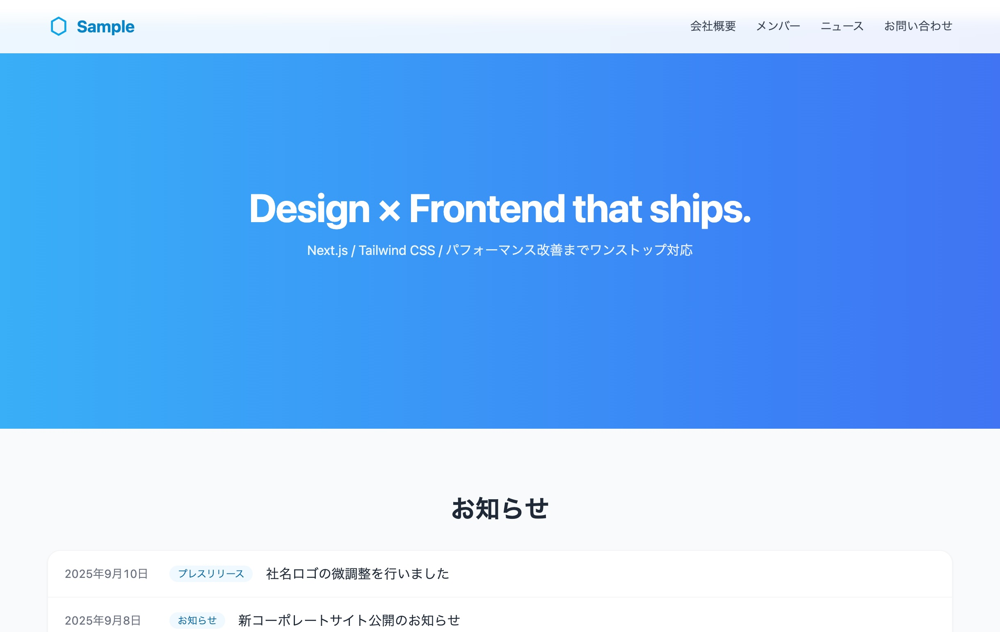
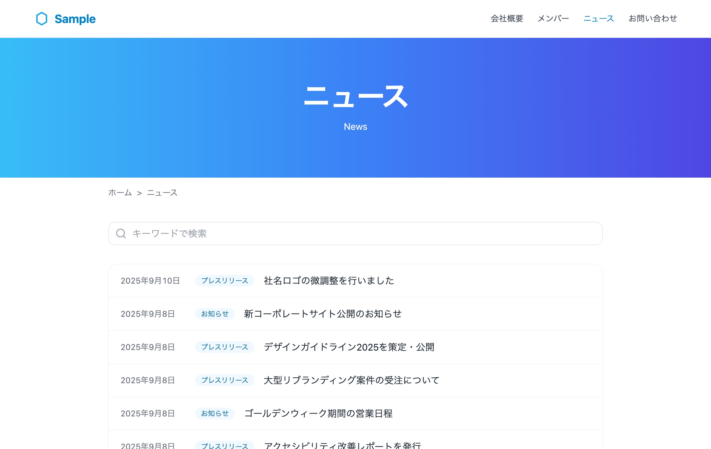
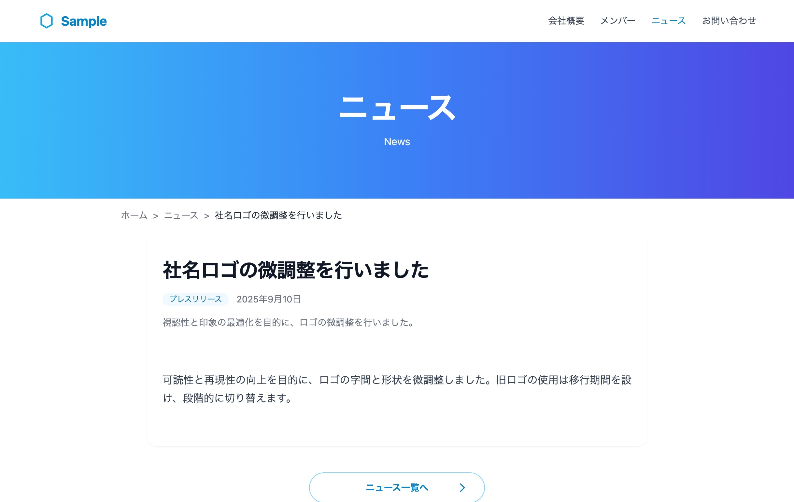
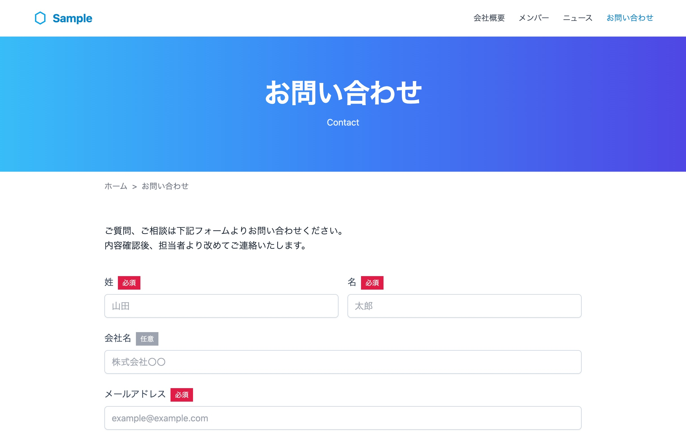
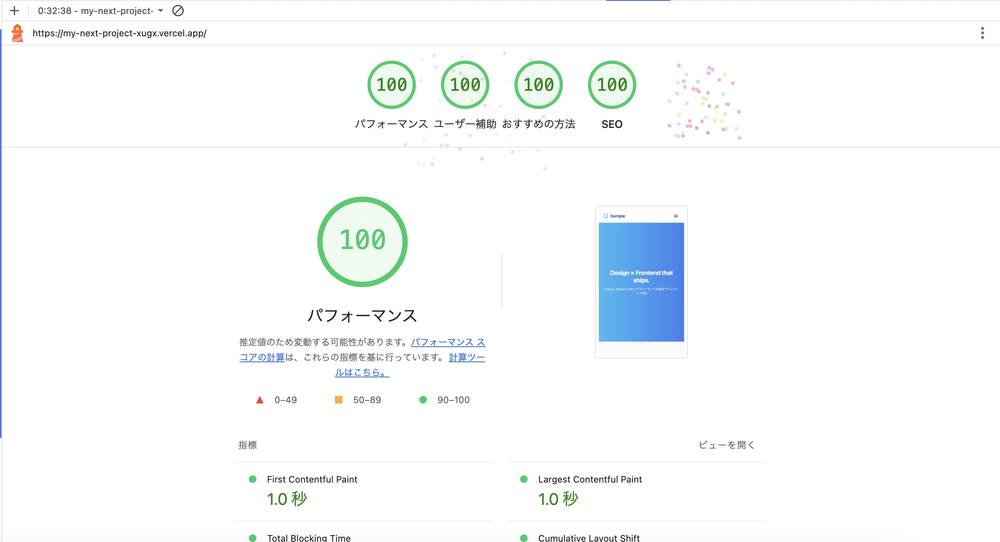

# Next.js × microCMS Corporate Site

このリポジトリは、Next.js と microCMS を利用して構築した  
デザイン会社を想定したコーポレートサイトのポートフォリオです。

## 使用技術

- **Framework**: Next.js v15 (App Router)
- **Language**: TypeScript
- **Styling**: Tailwind CSS
- **CMS**: microCMS
- **Deployment**: Vercel

## 実装機能

- トップページ／会社概要／メンバー／ニュース／お問い合わせページ
- microCMS 管理画面から編集可能：
  - **メンバー**ページ（メンバー情報を CMS から取得して表示）
  - **ニュース**ページ（一覧・詳細・カテゴリ絞り込み・ページネーション・検索対応）
- meta タグ・OGP・サイトマップなどの SEO 最適化
- お問い合わせフォーム（HubSpot 連携 + Honeypot + reCAPTCHA）
- Lighthouse パフォーマンス・SEO・アクセシビリティ 90 点以上達成
- アクセシビリティ（a11y）対応（ARIA 属性、カラーコントラスト調整、キーボード操作対応）

## スクリーンショット

## 公開 URL

https://my-next-project-xugx.vercel.app/

## 学習ポイント

- Next.js の App Router によるルーティングとサーバーコンポーネントの活用
- microCMS REST API（microcms-js-sdk） とのデータ取得
- 問い合わせフォームでの外部サービス（HubSpot）連携とセキュリティ対策（Honeypot, reCAPTCHA）
- Lighthouse 監査を通じたパフォーマンス・SEO・アクセシビリティ改善
